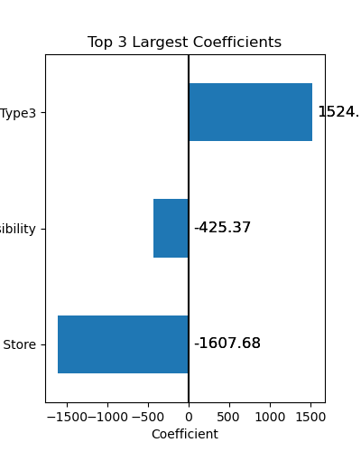
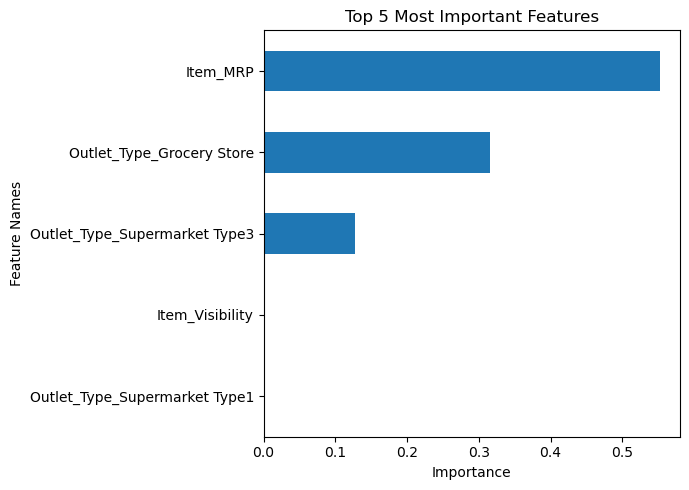

# **Prediction of Product Sales**

## Using regression models to predict the sales of food products 

- **Author:** Erica Kitano

### Business problem:
Help the retailer understand the properties of products and outlets that play crucial roles in increasing sales.

### Data:
The original source of the data used is `Big Mart Sales Prediction` from [this link](https://datahack.analyticsvidhya.com/contest/practice-problem-big-mart-sales-iii/).

### Methods
- Data cleaning:
  - checked for duplicates
  - filled in missing values with median value for the numerical column: `Item_Weight` 
  - filled in missing values with 'Unknown' for the categorical column: `Outlet_Size`
  - fixed inconsistent values in `Item_Fat_Content` column
- Performed Exploratory Analysis to understand the statistics and correlation of each feature to the target
- Performed Explanatory Analysis to show the relationship between `Item_MRP` and `Item_Outlet_Sales`

### Results

#### Regplot of `Item_MRP` vs `Item_Outlet_Sales`

> 

There is a positive correlation between `Item_MRP` and `Item_Outlet_Sales`.

#### Outlet_Type Count Plot

> 
> 
Supermarket Type1 has the highest count.

### Model

#### 1. Linear Regression Model

- Coefficient Plot

The top 3 most impactful features are:

1. Outlet_Type_Supermarket Type3:

  - This feature has a **positive** influence on the target (Item_Outlet_Sales) with a coefficient of 1524.25. 
  - Since this is a One-Hot-Encoded Categorical feature, it means that if the item belongs to this category, the Item_Outlet_Sales will be **increased** by **1524.25** rupees. 
  

2. Item_Visibility:
    
 - This feature has a **negative** influence on the target (Item_Outlet_Sales) with a coefficient of -425.37.  
 - Since this is a scaled numeric feature, it means that when I increase the value for this feature by 1 standard deviation, the Item_Outlet_Sales will be **decreased** by **425.37** rupees.

3. Outlet_Type_Grocery Store:

 - This feature has a **negative** influence on the target (Item_Outlet_Sales) with a coefficient of -1607.68.
 - Since this is a One-Hot-Encoded Categorical feature, it means that if the item belongs to this category, the Item_Outlet_Sales will be **decreased** by **1607.68** rupees.

#### 2. Tuned Random Forest Model

- Evaluation: 
 > Random Forest Test Scores
 > - Mean Average Error: 728.2810 
 > - Root Measn Squared Error: 1,046.6086 

- Analysis: 
    - Based on the overall metrics of all 4 models that were compared, the `Optimized Random Forest Tree Model` (max_depth=5, n_estimators=150) has the lowest MAE of **728** and RMSE of **1047** on the test data. 
    - The difference between RMSE and MAE implies that the model is making some larger errors as well.
    - Since the average value of `Item_Outlet_Sales` column is **2181** and the Mean Average Error on the Test data is about **728** for the optimized Random Forest model, the model is off by about **33.4 %** on average.
    
- Feature Importances Plot

The top 5 most important features are:
    
    - Item_MRP
    - Outlet_Type_Grocery Store
    - Outlet_Type_Supermarket Type3
    - Item_Visibility
    - Outlet_Type_Supermarket Type1

### Recommendations: 

Based on the evaluation,`Random Forest Model` is recommended.

### Limitations

For this set of data, even the best model (Optimized Random Forest Model) is underfit and have high bias. This can be explained from the observation that the features do not correlate well with the target and some values were imputed.

### For further information
For any additional questions, please contact ekitano1@gmail.com
