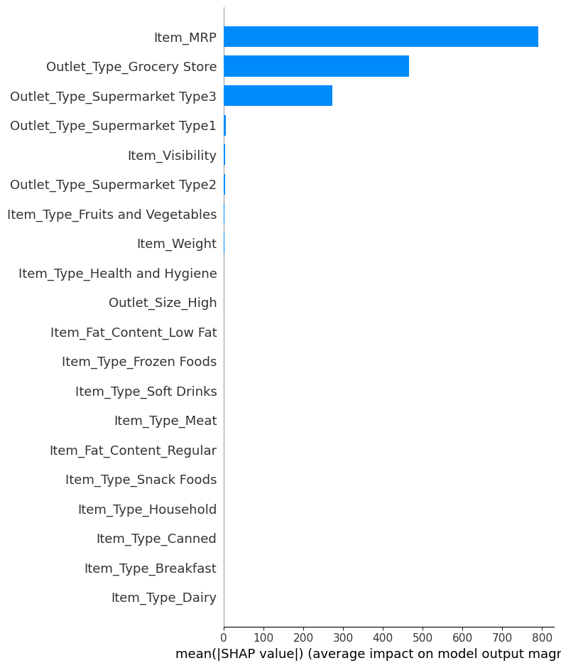
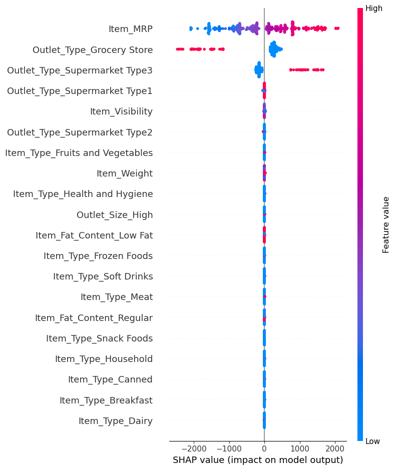
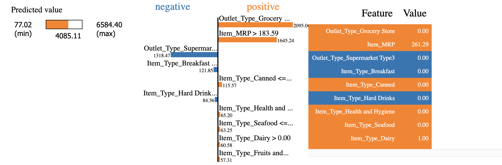
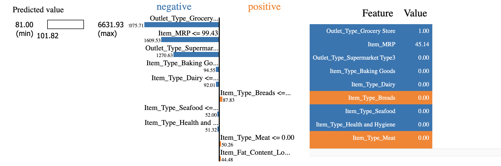
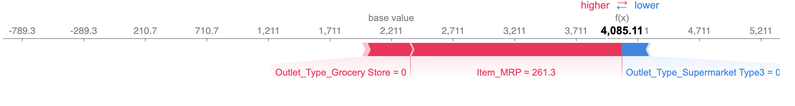
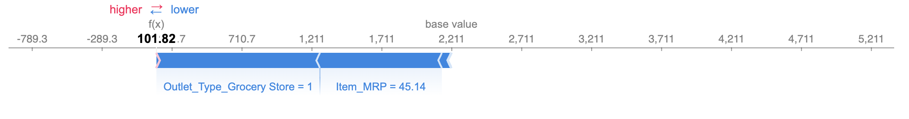

# **Prediction of Product Sales**

## Using regression models to predict the sales of food products 

- **Author:** Erica Kitano

### Business problem:
Help the retailer understand the properties of products and outlets that play crucial roles in increasing sales.

### Data:
The original source of the data used is `Big Mart Sales Prediction` from [this link](https://datahack.analyticsvidhya.com/contest/practice-problem-big-mart-sales-iii/).

### Methods
- Data cleaning:
  - checked for duplicates
  - filled in missing values with median value for the numerical column: `Item_Weight` 
  - filled in missing values with 'Unknown' for the categorical column: `Outlet_Size`
  - fixed inconsistent values in `Item_Fat_Content` column
- Performed Exploratory Analysis to understand the statistics and correlation of each feature to the target
- Performed Explanatory Analysis to show the relationship between `Item_MRP` and `Item_Outlet_Sales`

### Results

#### Regplot of `Item_MRP` vs `Item_Outlet_Sales`

> 

There is a positive correlation between `Item_MRP` and `Item_Outlet_Sales`.

#### Outlet_Type Count Plot

> 
> 
Supermarket Type1 has the highest count.

### Model

#### 1. Linear Regression Model

- **Coefficient Plot**

**The top 3 most impactful features are:**

**1. Outlet_Type_Supermarket Type3**

  - This feature has a **positive** influence on the target (Item_Outlet_Sales) with a coefficient of 1524.25. 
  - Since this is a One-Hot-Encoded Categorical feature, it means that if the item belongs to this category, the Item_Outlet_Sales will be **increased** by **1524.25** rupees. 
 

**2. Item_Visibility**
    
 - This feature has a **negative** influence on the target (Item_Outlet_Sales) with a coefficient of -425.37.  
 - Since this is a scaled numeric feature, it means that when I increase the value for this feature by 1 standard deviation, the Item_Outlet_Sales will be **decreased** by **425.37** rupees.

**3. Outlet_Type_Grocery Store**

 - This feature has a **negative** influence on the target (Item_Outlet_Sales) with a coefficient of -1607.68.
 - Since this is a One-Hot-Encoded Categorical feature, it means that if the item belongs to this category, the Item_Outlet_Sales will be **decreased** by **1607.68** rupees.

#### 2. Tuned Random Forest Model

- **Evaluation**: 
 > Random Forest Test Scores
 > - Mean Average Error: 728.2810 
 > - Root Measn Squared Error: 1,046.6086 

- **Analysis**: 
    - Based on the overall metrics of all 4 models that were compared, the `Optimized Random Forest Tree Model` (max_depth=5, n_estimators=150) has the lowest MAE of **728** and RMSE of **1047** on the test data. 
    - The difference between RMSE and MAE implies that the model is making some larger errors as well.
    - Since the average value of `Item_Outlet_Sales` column is **2181** and the Mean Average Error on the Test data is about **728** for the optimized Random Forest model, the model is off by about **33.4 %** on average.
    
- **Feature Importances Plot**

**The top 5 most important features are**:
    
    - Item_MRP
    - Outlet_Type_Grocery Store
    - Outlet_Type_Supermarket Type3
    - Item_Visibility
    - Outlet_Type_Supermarket Type1
    
- **SHAP summary plot - bar version**

**COMPARISON**: 
- **The top 5 most important features are the same between `SHAP` and Random Forest built-in `feature_importances_`**. 
  - The top 3 features are exactly in the same order for both methods. 
  - The order was swapped for the 4th and 5th feature when I compared SHAP and Random Forest feature_importances_.
  
- **SHAP summary plot - dot version**

**The top 3 most important features are**:

1. `Item_MRP`
2. `Outlet_Type_Grocery Store`
3. `Outlet_Type_Supermarket Type3`

**Interpretation**:
- `Item_MRP` 
   - This feature has the largest effect on the model's predictions as it was the first bar at the top of the plot.
   - Since the **red dots are on the positive side**, it means that the higher the Item_MRP, the more likely the model would predict that outlet sales is high.

- `Outlet_Type_Grocery Store`
   - This is a One-Hot-Encoded feature.
   - Since the **red dots are on the negative side**, it means that it is less likely that the model will predict high outlet sales if Outlet Type is Outlet_Type_Grocery Store.
   - If Outlet_Type_Grocery Store == 1, the model is less likely to predict high outlet sales.
   - If Outlet_Type_Grocery Store == 0, the model is more likely to predict high outlet sales.
   
- `Outlet_Type_Supermarket Type3`
   - This is a One-Hot-Encoded feature.
   - Since the **red dots are on the positive side**, it means that if the item is sold at Outlet_Type_Supermarket Type3, it is more likely that the model will predict the item to have high outlet sales. 
   - If Outlet_Type_Supermarket Type3 == 1, the model is more likely to predict high outlet sales.
   - If Outlet_Type_Supermarket Type3 == 0, the model is less likely to predict high outlet sales.
   
***

### Individual Examples:

I selected a row that had the lowest value in the target column and a row that had the highest value in the target column.

- Store that had the item with lowest sales had Outlet_Type of `Grocery Store`.
- Store that had the item with highest sales (within the 400 samples of SHAP) had Outlet_Type of `Supermarket Type1`.

### LIME tabular explanation

####  **Highest Sale in 400 samples**

**Interpretation**:
    
1. As we can see from above, an example item from Supermarket Type 1 group had a high predicted outlet sales value of **4085.11**.
2. Item_MRP being > 183.59 had a positive impact on the outlet sales. 
3. Not being an `Outlet_Type_Grocery Store` (Value == 0) had a positive impact on the outlet sales.
4. Not being an `Outlet_Type_Supermarket Type3` (Value == 0) had a negative impact on the outlet sales.

***

#### **Lowest Sale in 400 samples**

**Interpretation**:
    
1. As we can see from above, an example item from Grocery Store group had a low predicted outlet sales value of **101.82**.
2. Item_MRP being <=99.43 had a negative impact on the outlet sales. 
3. Being an `Outlet_Type_Grocery Store` (Value == 1) had an negative impact on the outlet sales.
4. Not being an `Outlet_Type_Supermarket Type3` (Value == 0) had a negative impact on the outlet sales.

***

### Force Plot

####  **Highest Sale in 400 samples**

**Interpretation**:
    
- Base value = 2211
- SHAP value = 4085.11
- The contributions of the red features are greater than the blue, which means there is a greater "push" towards **higher** outlet sales, so the final prediction is high outlet sales.
- The wider the segment is for the feature, the greater its contribution to the prediction is.
  - Therefore, in this case, Item_MRP is the biggest factor, followed by **not** being an Outlet_Type_Grocery Store.
  - The factor that is pushing the outlet sales to lower direction is that it is **not** an Outlet_Type_Supermarket Type3.

***

#### **Lowest Sale in 400 samples**

**Interpretation**:

- Base value = 2211
- SHAP value = 101.82
- The contributions of the blue features are much greater than the red which means a greater "push" towards **lower** outlet sales, so the final prediction is low outlet sales.
- The wider the segment is for the feature, the greater its contribution to the prediction is.
  - Therefore, in this case, the low Item_MRP value and the fact that it is an Outlet_Type_Grocery Store are contributing largely to the low predicted value.

***

### Recommendations: 

Based on the evaluation,`Random Forest Model` is recommended.

### Limitations

For this set of data, even the best model (Optimized Random Forest Model) is underfit and have high bias. This can be explained from the observation that the features do not correlate well with the target and some values were imputed.

### For further information
For any additional questions, please contact ekitano1@gmail.com
